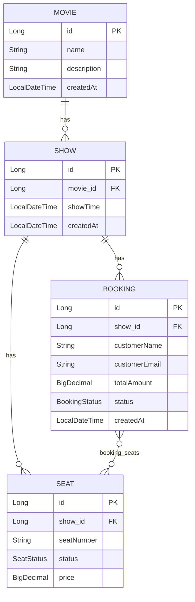

# Entity Diagram — Phase 1 (Basic CRUD)

## Relationships

- **Movie → Show**: one-to-many. One movie (e.g. "Inception") has multiple shows (6 PM, 9 PM).
- **Show → Seat**: one-to-many. Each show generates its own full set of seats.
- **Show → Booking**: one-to-many. A booking is always for seats of one specific show.
- **Booking ↔ Seat**: many-to-many, via the `booking_seats` join table. One booking can cover several seats (group booking); a seat, once booked, belongs to exactly one active booking.

## Enums

- `SeatStatus`: `AVAILABLE`, `BOOKED`
- `BookingStatus`: `CONFIRMED`, `CANCELLED`

## Notes

- No `User` entity yet — Phase 1 uses guest checkout (`customerName`, `customerEmail` directly on `Booking`). A proper `User` entity and ownership link arrive in Phase 5 (Security).
- All `@ManyToOne` relationships are explicitly `LAZY`, overriding JPA's `EAGER` default, to avoid accidental N+1 queries.
