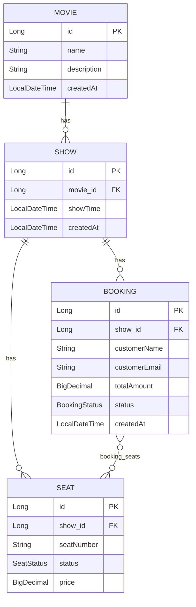

# Data Model — How Movie, Show, Seat, and Booking Relate

A quick guide for understanding the core domain of this project, aimed at a new developer joining the codebase.

## The four entities, in plain words

- **Movie** — the film itself (e.g. "Inception"). Just a name and description. No timing, no seats.
- **Show** — one specific screening of a movie, at one specific time (e.g. Inception, 6 PM). A show only exists because a movie exists to attach it to.
- **Seat** — one physical seat, but scoped to a single show, not the movie or the cinema in general. Seats are generated automatically the moment a show is created.
- **Booking** — a customer reserving one or more seats, all belonging to the same show.

## The relationship chain

```
Movie  →  Show  →  Seat
                 ↖  Booking (via booking_seats)
```

- **Movie → Show**: one-to-many. One movie can have several shows (different times, potentially different days). Each show belongs to exactly one movie.
- **Show → Seat**: one-to-many. Creating a show auto-generates a full layout for it (currently 5 rows × 10 seats = 50 seats, labeled A1–E10). Each seat belongs to exactly one show.
- **Booking ↔ Seat**: many-to-many, via a join table (`booking_seats`). One booking can cover several seats (a group booking). In practice a seat should only be attached to one *active* (non-cancelled) booking at a time — that rule is enforced in code, not by the database schema itself.

## Why seat labels can repeat, but seats themselves don't

The seat number `"A1"` exists once *per show*, not once overall. The 6 PM show has its own `A1`, and the 9 PM show has a completely different `A1` — different database row, different `id`, independent booking status. Booking `A1` for one show has no effect on `A1` for another.

Because of this, every seat-related operation needs to know **which show** it's talking about — that's why seat IDs alone aren't trusted blindly during booking; the code double-checks a seat actually belongs to the show being booked.

## ER Diagram



## One-line summary

**A seat only exists because a show exists, and a show only exists because a movie exists — nothing at the bottom of the chain can exist without everything above it.**